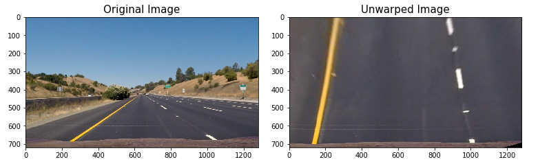
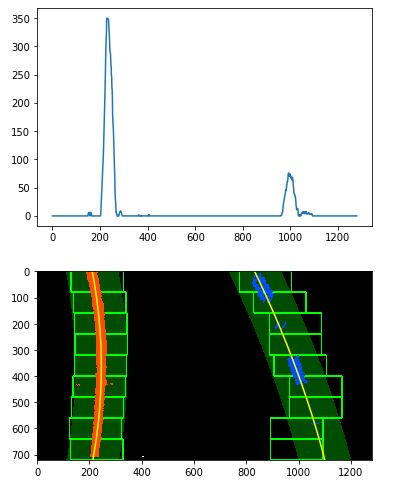
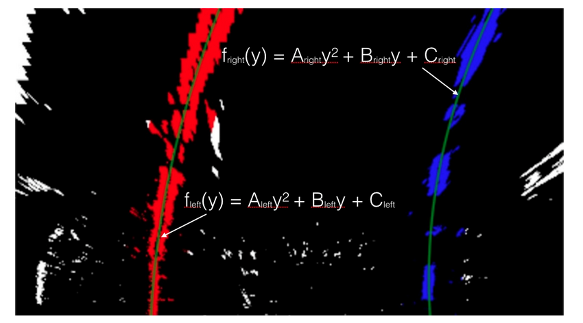
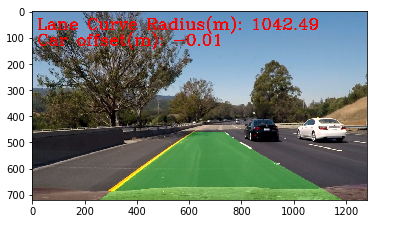

## Advanced Lane Finding

Overview
---
In this project, we will build a software pipeline to detect lane lines on videos through advance techniques such as color transforms, gradients, perspective transform and fitting polynomial.

Goals
---
- [Camera Calibration](./CarND-Advanced-Lane-Lines#camera-calibration)
  - Compute the camera calibration matrix and distortion coefficients given a set of chessboard images.
- [Pipeline (test images)]()
  - Apply a distortion correction to raw images.
  - Use color transforms, gradients, etc., to create a thresholded binary image.
  - Apply a perspective transform to rectify binary image ("birds-eye view").
  - Detect lane pixels and fit to find the lane boundary.
  - Determine the curvature of the lane and vehicle position with respect to center.
  - Warp the detected lane boundaries back onto the original image.
- [Pipeline (video)]()
  - Output visual display of the lane boundaries and numerical estimation of lane curvature and vehicle position.
- [Discussion]()
  - Discuss any problems / issues we faced in your implementation of this project. Where will our pipeline likely fail? What could you do to make it more robust?

Approach
---
- Compute the camera calibration matrix and distortion coefficients given a set of chessboard images.
- Apply a distortion correction to raw images.
- Use color transforms, gradients, etc., to create a thresholded binary image.
- Apply a perspective transform to rectify binary image ("birds-eye view").
- Detect lane pixels and fit to find the lane boundary.
- Determine the curvature of the lane and vehicle position with respect to center.
- Warp the detected lane boundaries back onto the original image.
- Output visual display of the lane boundaries and numerical estimation of lane curvature and vehicle position.
- Apply the image pipeline onto project video.
- Reflection

Result
---
 Project Video          |  Challenge Video |  Harder Challenge Video
 :-------------------------:|:-------------------------:|:-------------------------:
  | |  
 
Required Files
---
- [./notebook/CarND-Advanced-Lane-Lines.ipynb](./notebook/CarND-Advanced-Lane-Lines.ipynb) ( Note book contianing run of implementation )
- [README.md](./README.md) (a report writeup markdown file)
- [project_video_output.mp4](./output_videos/project_video_output.mp4) (a video output that applies advance lane lines)

Camera Calibration
---
- [Camera correct matrix points](./notebook/CarND-Advanced-Lane-Lines.ipynb) Ref In [3]
  - chessboard size to 9x6 however just using 9x6 you will 3 images would fail when finding points
  - Use a range as in 5,6 to 6,7,8,9 you will find how the below function work
  - cv2.findChessboardCorners: to find corners
  - cv2.drawChessboardCorners: to draw the corner
  - cv2.calibrateCamera: to calibrate camera
  - result can be found in [./output_images/corner_x](./output_images/)
   
- [Chess Undistort](./notebook/CarND-Advanced-Lane-Lines.ipynb) Ref In [7]
  - cv2.undistort: to undistort image using the calibated camera
  - result can be found in [./output_images/undistorted_calibrationX](./output_images/)
   

Pipeline (test images)
---
### [Example of Distortion Corrected Image and its application on test_images](./output_images/car-undistort.PNG)
  - cv2.undistort: to undistort image using the calibated camera
  - result can be found in **./output_images** [test1](./output_images/undistorted_test1.jpg), [test2](output_images/undistorted_test2.jpg), [test3](output_images/undistorted_test3.jpg), [test4](output_images/undistorted_test4.jpg), [test5](output_images/undistorted_test5.jpg), [test6](output_images/undistorted_test6.jpg), [straight1](output_images/undistorted_straight_lines1.jpg), [straight2](output_images/undistorted_straight_lines1.jpg)
   

### [Create threshold binary image](./output_images/threshold-binary.PNG)
- Result
    
- [undistort_and_threshold()](./notebook/CarND-Advanced-Lane-Lines.ipynb) function applies color transformation and sobel operator to generated thresholded binary image.
- **Color Channel Selection:** HLS color space Saturation channel used due to better lane lines detection
- **Gradients:** Sobel threshold X used as it identify lanes better
- Directional and Magnitude thresholds has very minimal to no effect on thresholded binary image.
- Color channel selection and Gradients are used to obtain thresholded binary image
   

### [Perspective Transformation](./output_images/birds-eye.png)
- [Result](./notebook/CarND-Advanced-Lane-Lines.ipynb) wrap and unwrap perspective transform.
   
- [All image Result](./output_images/bird-eye-all.png)
- using cv2.getPerspectiveTransform(src, dst) for perspective transform
- using cv2.getPerspectiveTransform(dst, src) for perspective transform [DST/SRC inversed]
- using cv2.warpPerspective(img, M, (w,h), flags=cv2.INTER_LINEAR) to wrap perspective
- Define 4 source and 4 destination points (this is done by trail and error and checking which workd better)

### [Polynomial Fitting](./output_images/polyfit.png)
- [Result](./notebook/CarND-Advanced-Lane-Lines.ipynb) wrap and unwrap perspective transform.
   
- polyfit function's like [sliding_window_poly_fit() and polyfit_from_previous()](./notebook/CarND-Advanced-Lane-Lines.ipynb) identify lane-line pixels and fit their positions with a polynomial.
- histogram peaks of bottom half of the binary thresholded image is used to find base of left and right line(as shown above).
- use a sliding window, placed around the line centers, to find and follow the lines up to the top of the frame to identify lane-line pixels and then fit a 2 degree polynomial.

### [Radius of curvature](./notebook/CarND-Advanced-Lane-Lines.ipynb)
   
- [Reference](https://www.intmath.com/applications-differentiation/8-radius-curvature.php)
- [curvature() function](./notebook/CarND-Advanced-Lane-Lines.ipynb) is responsible to calculate radius of curvature and vehicle offset with center. 
- road curve either left or right affects vehicle position estimation which happen at top then bottom thus the value 720 and 900 for calculating polynomial intercept.
- fit new polynomials to x,y in world space
- calculate the radii of curvature
- calculate car_pos, lane_center and vechicle offset
- assumption camera is mounted at the center of the car and deviation of midpoint of the lane from center of image.
	
### [Example of plotted result to identify lane area](./output_images/process-result.png)
   
- [process_image()](./notebook/CarND-Advanced-Lane-Lines.ipynb) function does the detecting of lane lines for the above image.
- indicated lane boundaries on original image
- it shows the lanes, curvature and position from center(in meters)

Pipeline (video)
---
     
- [RESULT](https://github.com/vinayakkankanwadi/CarND-Advanced-Lane-Lines#result)
- [Project Original Video](./project_video.mp4)
- [Project Output Video](./output_videos/project_video_output.mp4)
- image processing pipeline successfully processes the video
- outputs generated regarding the radius of curvature of lane and vechicle position within the lane
- pipeline correctly map's out curved lines and does not fail on shadows or pavement color changes

Discussion
---
- There was no good fit solution as such. One had to try different combinations and thresholds.
- Right combination of color channel and gradient.
- Perspective transform values for SRC and DST again had to be tried for different values.
- Wrapped images considered only for 2 lines.
- Challenge video fails as it has 3 lines from histogram peak

### Things that can be done better
- Normalizing image, lighting conditions, shadows, discoloration
- Narrow down area or region of interest
- Adding Denoising
- Consider threshold of more than 2 lines, probably discard using region of interest of discard pixel near polyfit
- handling illumination color shades like in challenge video

Suggestions to Make Your Project Stand Out!
---
As shown in above in Result the challenge video and hard challenge video have a hard time when using the pipeline :)
- [Challenge Video](./output_videos/challenge_video_output.mp4)
- [Hard Challenge Video](./output_videos/harder_challenge_video_output.mp4)
---

