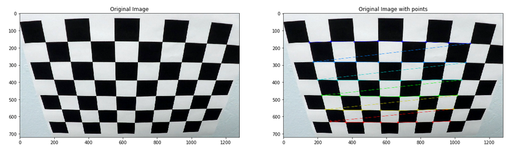

## Advanced Lane Finding

Overview
---
In this project, we will build a software pipeline to detect lane lines on videos through advance techniques such as color transforms, gradients, perspective transform and fitting polynomial.

Goals
---
- [Camera Calibration]()
  - Compute the camera calibration matrix and distortion coefficients given a set of chessboard images.
- [Pipeline (test images)]()
  - Apply a distortion correction to raw images.
  - Use color transforms, gradients, etc., to create a thresholded binary image.
  - Apply a perspective transform to rectify binary image ("birds-eye view").
  - Detect lane pixels and fit to find the lane boundary.
  - Determine the curvature of the lane and vehicle position with respect to center.
  - Warp the detected lane boundaries back onto the original image.
- [Pipeline (video)]()
  - Output visual display of the lane boundaries and numerical estimation of lane curvature and vehicle position.
- [Discussion]()
  - Discuss any problems / issues we faced in your implementation of this project. Where will our pipeline likely fail? What could you do to make it more robust?

Approach
---
- Compute the camera calibration matrix and distortion coefficients given a set of chessboard images.
- Apply a distortion correction to raw images.
- Use color transforms, gradients, etc., to create a thresholded binary image.
- Apply a perspective transform to rectify binary image ("birds-eye view").
- Detect lane pixels and fit to find the lane boundary.
- Determine the curvature of the lane and vehicle position with respect to center.
- Warp the detected lane boundaries back onto the original image.
- Output visual display of the lane boundaries and numerical estimation of lane curvature and vehicle position.

Result
---
 Project Video          |  Challenge Video |  Harder Challenge Video
 :-------------------------:|:-------------------------:|:-------------------------:
  | |  
 
Required Files
---
- [CarND-Advanced-Lane-Lines.ipynb](./notebook/CarND-Advanced-Lane-Lines.ipynb) ( Note book contianing run of implementation )
- [README.md](./README.md) (a report writeup markdown file)
- [project_video_output.mp4](./output_videos/project_video_output.mp4) (a video output that applies advance lane lines)

Camera Calibration
---
- Camera correct matrix points
   
- Chess Undistort
   
- Car Line Lane Undistort
   

OpenCV functions or other methods were used to calculate the correct camera matrix and distortion coefficients using the calibration chessboard images provided in the repository (note these are 9x6 chessboard images, unlike the 8x6 images used in the lesson). The distortion matrix should be used to un-distort one of the calibration images provided as a demonstration that the calibration is correct. Example of undistorted calibration image is Included in the writeup (or saved to a folder).

TODO

The images for camera calibration are stored in the folder called `camera_cal`.  The images in `test_images` are for testing your pipeline on single frames.  If you want to extract more test images from the videos, you can simply use an image writing method like `cv2.imwrite()`, i.e., you can read the video in frame by frame as usual, and for frames you want to save for later you can write to an image file.  

To help the reviewer examine your work, please save examples of the output from each stage of your pipeline in the folder called `ouput_images`, and include a description in your writeup for the project of what each image shows.    The video called `project_video.mp4` is the video your pipeline should work well on.  

The `challenge_video.mp4` video is an extra (and optional) challenge for you if you want to test your pipeline under somewhat trickier conditions.  The `harder_challenge.mp4` video is another optional challenge and is brutal!

If you're feeling ambitious (again, totally optional though), don't stop there!  We encourage you to go out and take video of your own, calibrate your camera and show us how you would implement this project from scratch!

